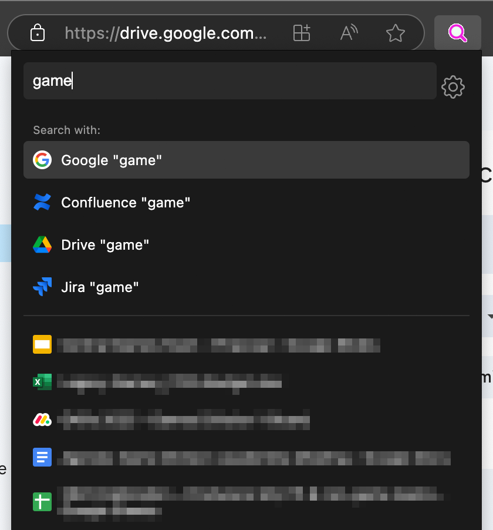

# Tab Spotlight

A Chrome/Edge extension that provides a spotlight-style tab switcher and web search, similar to Arc browser's command bar.

## Features

- 🔍 Quickly search and switch between open tabs
- 🌐 Google search from the same interface
- ⌨️ Keyboard navigation (arrow keys, enter, escape)
- 🎨 Clean, dark interface inspired by Arc browser
- ⚡ Fast and lightweight

## Installation

### From Chrome Web Store (Coming Soon)

*The extension will be available on the Chrome Web Store soon.*

### Manual Installation

1. Download or clone this repository
2. Open Chrome/Edge and navigate to `chrome://extensions` or `edge://extensions`
3. Enable "Developer mode" in the top-right corner
4. Click "Load unpacked" and select the extension directory
5. The extension is now installed!

## Usage

1. Press `Cmd+Shift+Space` (Mac) or `Ctrl+Shift+Space` (Windows/Linux) to open Tab Spotlight
2. Type to search through your open tabs
3. Use arrow keys to navigate the results
4. Press Enter to switch to the selected tab or perform a Google search
5. Press Escape to close the popup

### Changing the Keyboard Shortcut

If you want to use a different keyboard shortcut:

1. Go to `chrome://extensions/shortcuts` or `edge://extensions/shortcuts`
2. Find "Tab Spotlight" in the list
3. Click the input field for the shortcut
4. Press your desired key combination (e.g., Option+Space on Mac)
5. The new shortcut is now set!

## Development

### Project Structure

- `manifest.json` - Extension configuration
- `background.js` - Background service worker
- `popup.html` - Popup UI structure and styles
- `popup.js` - Tab search and navigation logic
- `icons/` - Extension icons

### Building from Source

No build step is required! The extension uses vanilla JavaScript and can be loaded directly.

### Contributing

Contributions are welcome! Feel free to open issues or submit pull requests.

## License

MIT License - see the LICENSE file for details.

## Acknowledgements

- Inspired by the Arc browser's command bar
- Icon created by [Your Name/Source]
